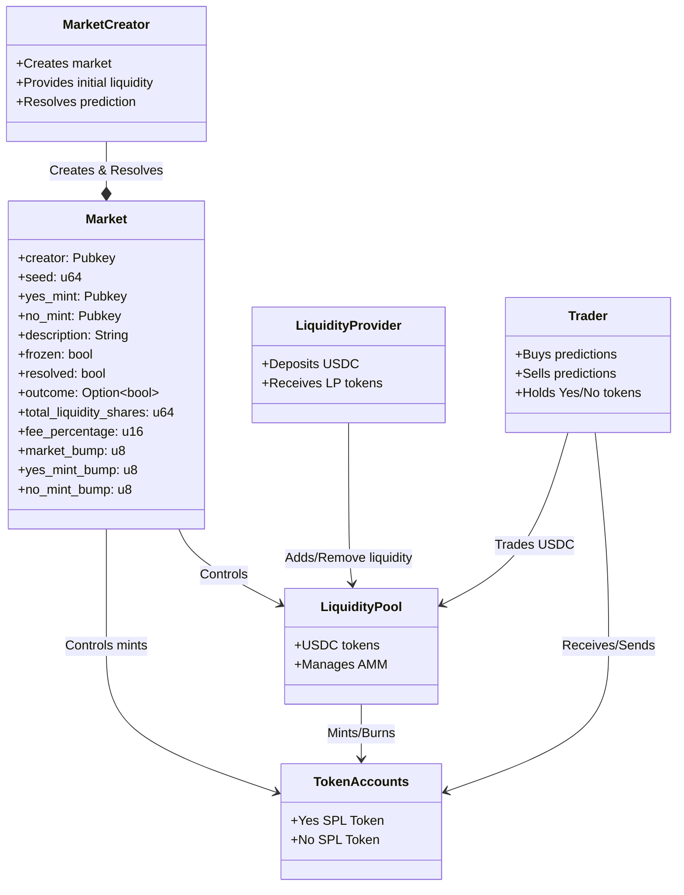
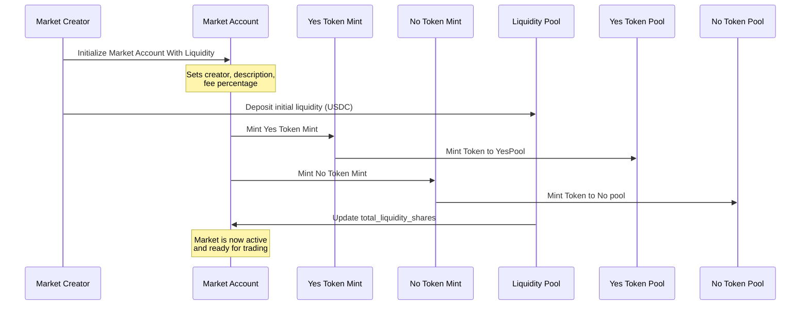
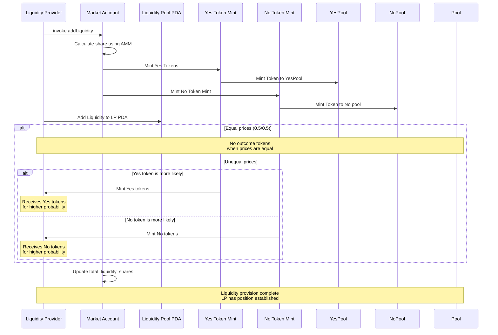
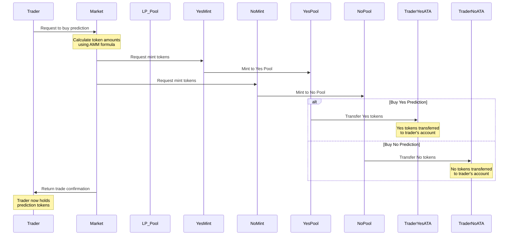
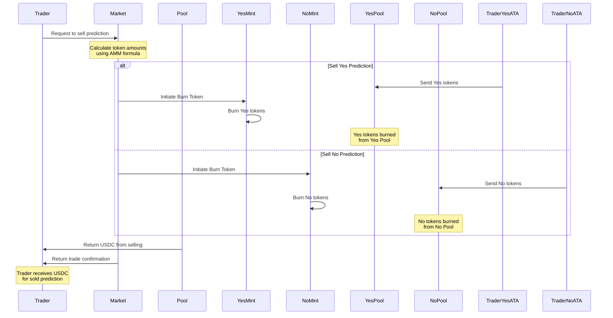
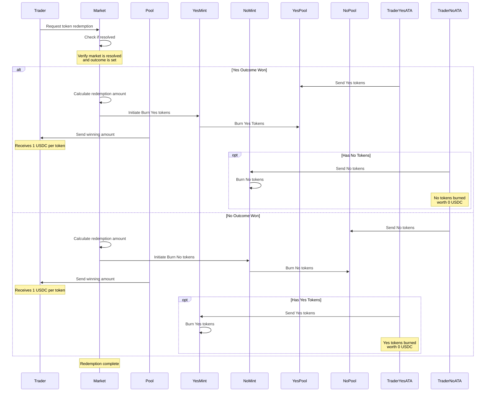

# ARCHITECTURE

## POC requirements

The Protocol allows:

1. market creators to post prediction questions based on the available oracles
2. market creators put in initial liquidity in USDC tokens which will depsosited inside the pool
3. Liquidity Providers to deposit USDC as liquidity which will deposited inside the pool
4. Traders/Content consumers can buy the prediction(s) after the liquidity is provided and before the resolution
5. Traders/Content consumers can sell the prediction(s) after purchasing the prediction and before resolution.
6. Buying prediction will recieve yes/no SPL token to the traders/content consumers' token account
7. market creator can resolve the prediction after the resolution time

## Overview

key components of the F4See prediction market architecture:

- Market Account: The central program containing all market parameters and state
- Market Creator: Creates markets, provides initial liquidity, and resolves predictions
- Liquidity Pool: Holds USDC tokens
- Liquidity Providers: Can deposit/withdraw additional USDC to increase market liquidity
- Traders: Can buy/sell predictions using USDC and receive Yes/No SPL tokens
- Token Accounts: Manages the Yes/No SPL tokens that represent predictions

### Create Market - SD

#### Market Creator initializes the Market Account with

- Market description
- Fee percentage
- Liquidity
- Yes Token Mint is created with Market as authority
- No Token Mint is created with Market as authority
- Initial USDC is deposited into Liquidity Pool
- Market's total_liquidity_shares is updated

### Provide Initial Liquidity

### Liquidity Provided provides liquidity

two main scenarios:

1. Equal Prices (0.5/0.5):

   - No outcome tokens are minted to Liquidity provided
   - Simple liquidity addition

2. Unequal Prices:

   - AMM calculates token distribution using constant product formula
   - Additional outcome tokens for the more likely outcome to LP

3. USDC is transferred to the pool
4. Market's total_liquidity_shares is updated

## Buy Prediction

### Trader Buys Prediction

1. Initial Request:

   - Trader initiates buy request
   - Market performs AMM calculations internally

2. Fee Processing:

   - Pool calculates trading fees based on market settings
   - Final amount determined after fees

3. Token Minting:
   - Yes or No tokens are minted based on prediction choice
   - Tokens are sent to trader's token account

## Trader Sells Token

1. Token Flow:

   - Instead of minting new tokens, existing tokens are burned
   - Tokens flow from Trader's Associated Token Account to the respective mint for burning

2. USDC Flow:

   - Trader receives USDC in return for burned prediction tokens

3. Process Order:

   - Starts with token burn approval
   - Ends with USDC transfer to trader

## Market Resolution

1. Initial Check:

   - Trader requests redemption
   - Market verifies it's resolved and outcome is set

2. Winning Outcome Handling:

   - If Yes won:

     1. Yes tokens are burned and redeemed for 1 USDC each
     2. No tokens can be burned but are worth 0 USDC

   - If No won:

     1. No tokens are burned and redeemed for 1 USDC each
     2. Yes tokens can be burned but are worth 0 USDC

3. Pool Updates:

   - Pool state is updated after redemption
   - Final confirmation to trader
